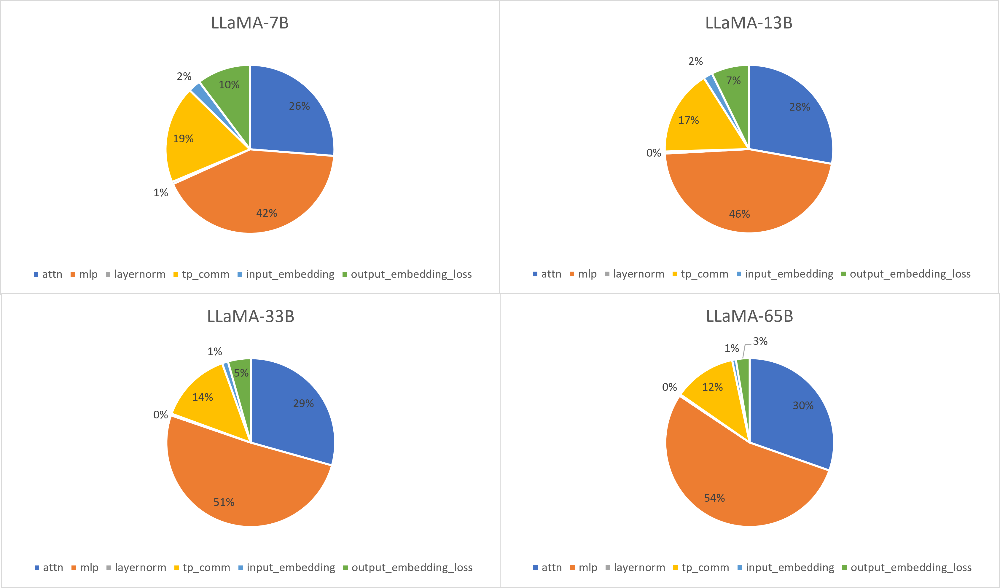
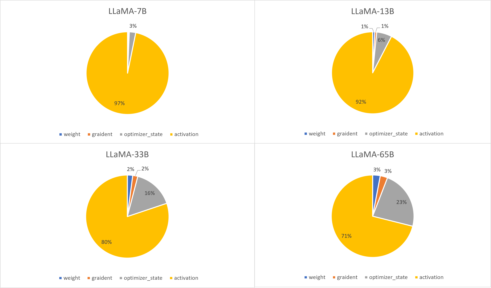
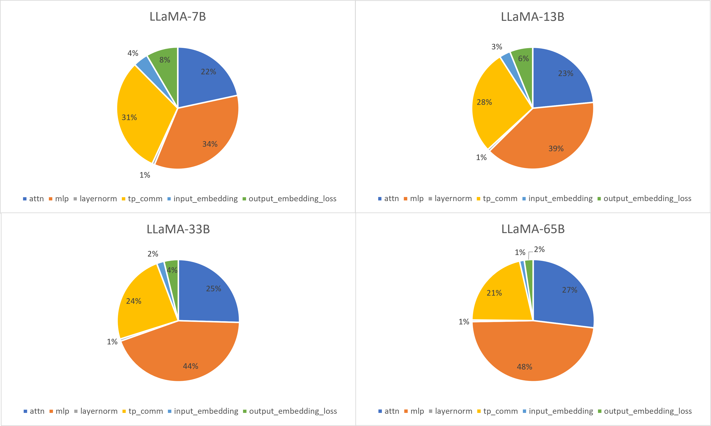

# Example Analyses with LLaMA Models

[LLaMA](https://github.com/facebookresearch/llama) is a collection of foundation language models of `6.7B`, `13.0`, `32.5`, and `65.2B` parameters. The model information is shown below.

The [paper](https://arxiv.org/abs/2302.13971) reports their code processes around `380` tokens/sec/GPU on `2048` A100 GPU with 80GB of RAM, and the training performance are summarized  in the below table.

The analyses below are performed with llm-analysis as a showcase.

- [Example Analyses with LLaMA Models](#example-analyses-with-llama-models)
  - [Training Analysis](#training-analysis)
    - [GPU Hours](#gpu-hours)
    - [Ideal FlOPS and Memory Efficiency](#ideal-flops-and-memory-efficiency)
    - [Using H100 GPU](#using-h100-gpu)
  - [Inference Analysis](#inference-analysis)
    - [Prefill and Decode Latency](#prefill-and-decode-latency)
    - [Quantization](#quantization)
  - [References](#references)

## Training Analysis

For training analysis, we use `flops_efficency = 0.5` and `hbm_memory_efficiency = 0.9` as observed by the literature.
The setup follows the paper description and is detailed in the [run_train.sh](run_train.sh) script.
The output summaries are in [outputs_train](outputs_train) directory (both raw and readable jsons are produced).
For example, [here](outputs_train/decapoda-research_llama-65b-hf-a100-sxm-80gb-w16a16e16-tp8-pp8-dp32-sp8-fe0.5-hbme0.9-summary-readable.txt) is a full readable summary of LLaMA-65B model.

llm-analysis provides details about time and memory, as presented below.

### GPU Hours

The table below compares the outputs from llm-analysis to the reported `GPU-hours` in the LLaMA paper. The last column shows the difference, suggesting llm-analysis gives a good estimate of training time.

| params     | LLaMA paper GPU-hours | llm-analysis GPU-hours | diff. % |
|------------|-----------------------|------------------------|---------|
| LLaMA-7B   | 82,432                | 77,832                 | -5.58   |
| LLaMA-13B  | 135,168               | 148,047                |  +9.53  |
| LLaMA-33B  | 530,432               | 510,213                | -3.81   |
| LLaMA-65B  | 1,022,362             | 1,015,701              | -0.65   |

- Time Breakdown

- Memory Breakdown

Blow shows some example analyses that advise the benefit of using a different training setup. There are many more you can do, try it out!

### Ideal FlOPS and Memory Efficiency

Setting FLOPS and memory efficiency (`flops_efficiency` and `hbm_memory_efficiency` in the script) to `1` gives the lower-bound time estimation.
It suggests through system optimizations how much the performance can be further improved. The corresponding output summaries are in the [outputs_train_ideal](outputs_train_ideal ) directory.

The GPU-hours are halved as expected, as the training is compute-bound.
We can quantitatively see from the new time breakdown below that the time portion of tensor parallelism communication (`tp_comm`) and input embedding lookup (`input_embedding`) increases while the other parts decrease.

- Time Breakdown with Ideal Efficiency

### Using H100 GPU

In this analysis, we show how the training performance changes when different GPUs are used. To list all predefined GPUs, run `python -m llm_analysis.config list_gpu_configs`).
Setting `gpu_name` to [h100-sxm-80gb](../../llm_analysis/gpu_configs/h100-sxm-80gb.json) in the [run_train.sh](run_train.sh) script uses H100-SXM 80GB GPUs. The corresponding output summaries are in `outputs_train_h100` directory.

The GPU-hours are reduced by `84 %` as expected, as the training is compute-bound and `h100-sxm-80gb` has a peak FP16 TFLOPS of `1979` compared to `312` for [a100-sxm-80gb](../../llm_analysis/gpu_configs/h100-sxm-80gb.json).
While the peak FLOPS from A100 to H100 increases by more than $6\times$, the HBM memory bandwidth only increases from `2032 GB/s` to `3350 GB/s`, thus the `tp_comm` takes more share in the time breakdown, as shown below.

- Time Breakdown with H100

## Inference Analysis

As an example inference analysis, if not mentioned, we use ideal flop and memory efficiency, [w16a16e16](../../llm_analysis/dtype_configs/w16a16e16.json), context sequence length `512`, batch size `1`, number of tokens to generate `32`, and A100-SXM-80GB GPU. Note that LLaMA-65B requires `2` GPUs if using w16a16e16.
### Prefill and Decode Latency

Below shows the prefill and decode (per token) latency for the LLaMA models.
The script used is in [run_infer.sh](run_infer.sh) and the output summaries are in [outputs_infer_ideal](outputs_infer_ideal).
Results for `flops_efficency (fe) = 0.5` and `hbm_memory_efficiency (hbme) = 0.9` (in [outputs_infer](outputs_infer)) are also presented as a comparison.

| model     | ideal prefill latency  (ms) | ideal decode latency (ms) | prefill latency with fe=0.7, hbme=0.9 (ms) | decode latency with fe=0.7, hbme=0.9 (ms) |
|-----------|-----------------------------|---------------------------|--------------------------------------------|-------------------------------------------|
| LLaMA-7B  | 22.41                       | 6.73                      | 31.89                                      | 7.48                                      |
| LLaMA-13B | 43.1                        | 12.94                     | 61.38                                      | 14.38                                     |
| LLaMA-33B | 107.74                      | 32.36                     | 153.6                                      | 35.95                                     |
| LLaMA-65B (tp_size=2)| 113.33                      | 33.85                     | 159.47                                     | 37.47                                     |

Below shows the time breakdown for the decode stage in ideal model inference.

- decode time breakdown

### Quantization

Below shows the prefill and decode (per token) latency with different quantization schemes (data types) in ideal model inference. The following data type configuraions are compared to the [w16a16e16](../../llm_analysis/dtype_configs/w16a16e16.json): [w4a4e16](../../llm_analysis/dtype_configs/w4a4e16.json), [w4a8e16](../../llm_analysis/dtype_configs/w4a8e16.json), [w4a16e16](../../llm_analysis/dtype_configs/w4a16e16.json), and [w8a8e16](../../llm_analysis/dtype_configs/w8a8e16.json).
The output summaries for these schemes are in `output_infer_ideal_[scheme]`.

Note that to leverage INT4 (or INT8) GEMM, both weights and activations need to be in INT4 (or INT8).

- prefill latency

| prefill latency (ms) | w16a16e16 | w4a4e16 | w4a8e16 | w4a16e16 | w8a8e16 |
|----------------------|-----------|---------|---------|----------|---------|
| LLaMA-7B             | 22.41     | 5.9     | 11.4    | 22.41    | 11.4    |
| LLaMA-13B            | 43.1      | 11.2    | 21.83   | 43.1     | 21.83   |
| LLaMA-33B            | 107.74    | 27.69   | 54.38   | 107.74   | 54.38   |
| LLaMA-65B            | 113.33    | 55.2    | 108.83  | 216.08   | 108.83  |

- decode latency

| decode latency (ms) | w16a16e16 | w4a4e16 | w4a8e16 | w4a16e16 | w8a8e16 |
|---------------------|-----------|---------|---------|----------|---------|
| LLaMA-7B            | 6.73      | 1.78    | 1.85    | 1.99     | 3.43    |
| LLaMA-13B           | 12.94     | 3.36    | 3.47    | 3.69     | 6.55    |
| LLaMA-33B           | 32.36     | 8.25    | 8.46    | 8.89     | 16.28   |
| LLaMA-65B           | 33.85     | 16.41   | 16.76   | 17.47    | 32.56   |

## References

- [LLaMA: Open and Efficient Foundation Language Models](https://arxiv.org/abs/2302.13971)
